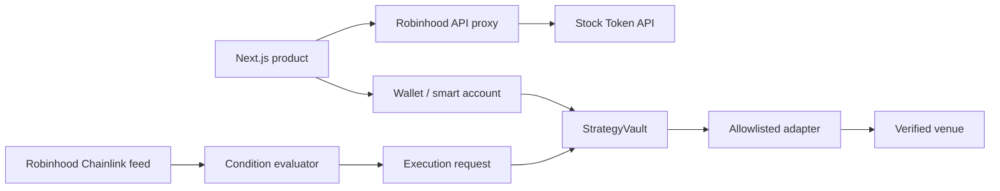

# Rook

**Programmable markets on Robinhood Chain.** Rook turns a market rule into a constrained automation: create it, simulate it, define exactly what it may spend, activate it, and observe every result.

## Why it exists

Tokenized assets are programmable, but most automation products expose either trading-terminal complexity or unsafe blanket wallet authority. Rook uses sentence-like rules and a permission vault so the interface and contract enforce the same limits.

## Robinhood Chain integration

- Mainnet: chain ID `4663`; testnet: `46630`; ETH is the native gas token.
- Asset metadata and current quotes: Robinhood's read-only Stock Token API. Missing values stay unavailable—Rook never synthesizes them.
- Stock Tokens are ERC-20 tokens with ERC-8056 UI multipliers. The onchain Chainlink feed is already multiplier-adjusted.
- Account abstraction path: ERC-4337/EIP-7702 with Alchemy or ZeroDev session/spend policies. The current preview uses an injected EVM wallet and testnet network request; production AA credentials are intentionally absent.
- Execution venues must be explicitly verified and allowlisted. No router address is hardcoded in this repository.

## Architecture



Condition observation is separate from authorization. An executor can request execution, but `StrategyVault` independently checks executor/adapter allowlists, status, expiry, exact oracle observation, freshness, per-execution cap, total allocation, and available funded balance.

## Strategy lifecycle

1. **Create** a condition and action.
2. **Simulate** deterministically; no historical claims are made without a verified dataset.
3. **Fund / authorize** a bounded amount and expiry.
4. **Activate** through a testnet wallet or smart-account policy.
5. **Observe**, pause, or revoke. Revocation returns the remaining vault balance.

## Local setup

Requirements: Node.js 22.13+, npm, and Foundry for contract work.

```bash
cp .env.example .env.local
npm install
npm run dev
```

The app is available at `http://localhost:3000`. Do not put private keys in any `NEXT_PUBLIC_` variable.

## Environment variables

See `.env.example`. Frontend defaults are the documented Robinhood Chain testnet values. `DEPLOYER_PRIVATE_KEY`, provider keys, gas-policy IDs, and a deployed vault address are operator-supplied and never committed.

## Contracts and testnet deployment

```bash
forge build
forge test
forge create contracts/src/StrategyVault.sol:StrategyVault \
  --rpc-url "$ROBINHOOD_RPC_URL" --private-key "$DEPLOYER_PRIVATE_KEY" \
  --constructor-args <ADMIN_ADDRESS>
```

Verify the deployed source against `https://explorer.testnet.chain.robinhood.com/api/`. Before any public deployment, replace the single admin with a reviewed multisig/timelock, audit every adapter, and configure per-feed heartbeats plus the L2 sequencer uptime check.

## Testing

```bash
npm run lint
npm run build
forge test
```

The Foundry suite covers owner withdrawal/revocation, executor authorization, spend caps, and stale-oracle rejection.

## Known limitations

- The hosted product is an honest testnet preview: strategy records persist locally in the browser, and activation does not submit a deployment transaction until `NEXT_PUBLIC_STRATEGY_VAULT_ADDRESS` and an audited venue adapter are configured.
- Robinhood's Stock Token API supplies current metadata/quotes, not historical backtests or 24-hour change in this implementation.
- Stock Tokens are restricted financial instruments and are unavailable in several jurisdictions. Rook is not investment advice and does not bypass issuer or venue eligibility controls.
- `PercentageRise` and `PercentageFall` require a signed reference observation/checkpoint design before production execution; the included vault fully validates absolute price conditions and treats recurring evaluation separately.

Read [architecture](docs/ARCHITECTURE.md), [security](docs/SECURITY.md), and the [demo runbook](docs/DEMO.md).
