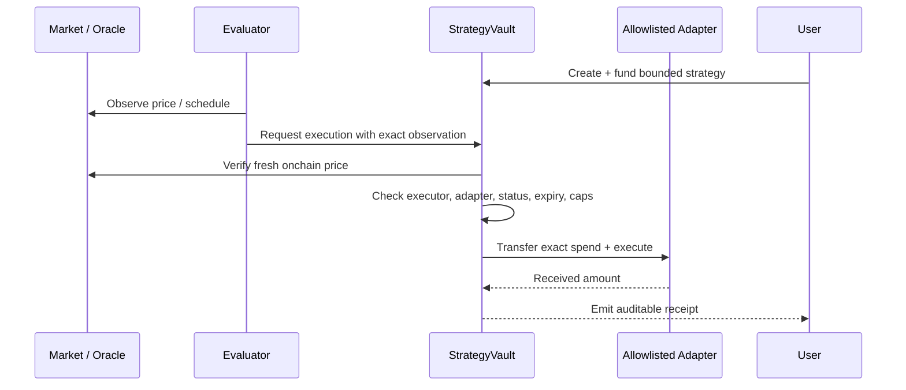

# Architecture

## Boundaries

### Frontend

The Vinext/Next.js TypeScript client contains Market, Create, My Rooks, and Explore views. The server route `/api/market` proxies only documented, read-only Robinhood endpoints and applies their cache windows. Disconnected, loading, empty, and unavailable states are first-class.

### Automation service

The evaluator is intentionally not implemented as a custodian. A production service watches Chainlink/RPC data, creates an execution request, and signs it with an allowlisted executor key. That key alone cannot select arbitrary tokens, exceed a user's caps, use an unapproved adapter, or withdraw funds.

### Onchain

`StrategyVault` keeps the auditable permission definition and funded balance. Mutable operational allowlists belong to governance. Strategy ownership, assets, action, caps, total spent, expiry, status, and oracle freshness constraints are onchain. Presentation copy, drafts, discovery metadata, and simulations stay offchain.

### Data

Current Stock Token metadata and quotes come from `https://api.robinhood.com/rhj/`. Mainnet contracts are discovered from its deployment records rather than copied into source. Chainlink feed addresses and heartbeat values must be sourced from Chainlink at deployment time. Real receipts link to the chain's Blockscout explorer.
